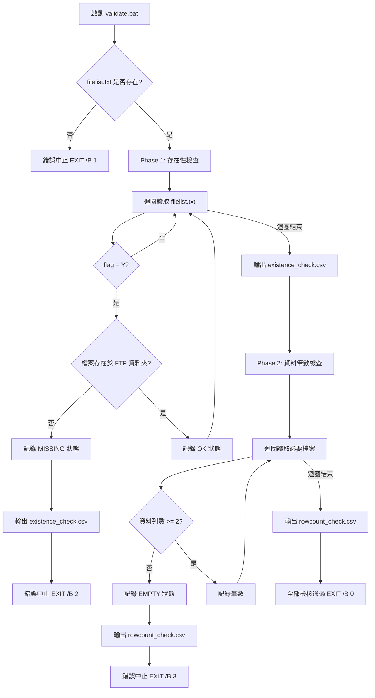
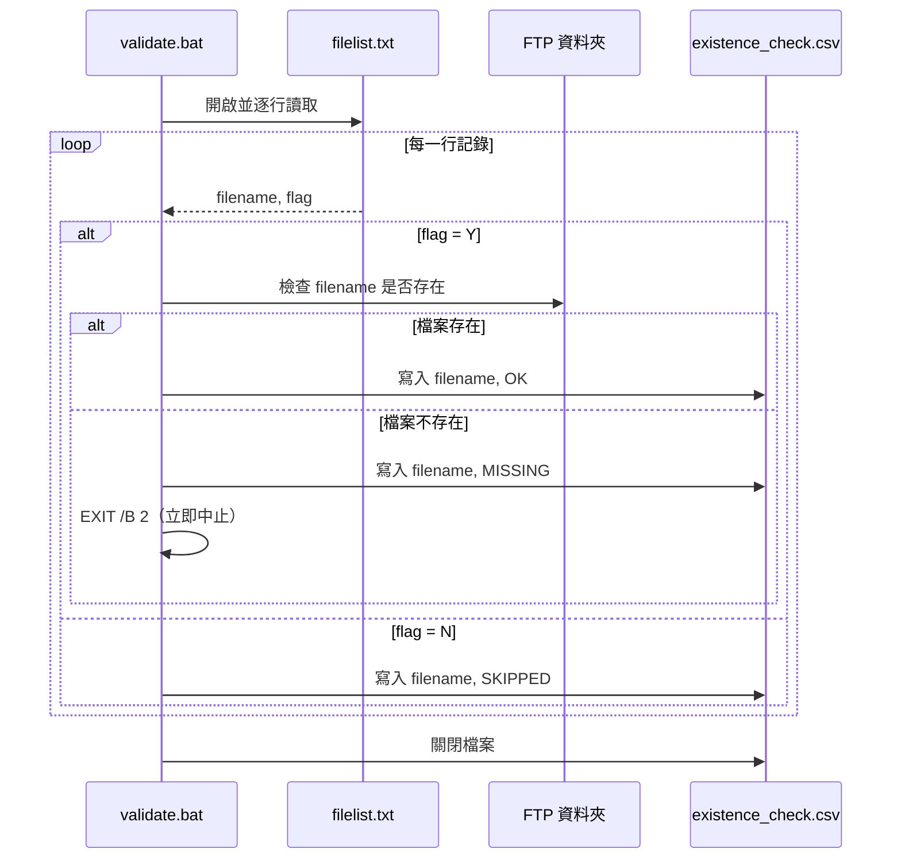
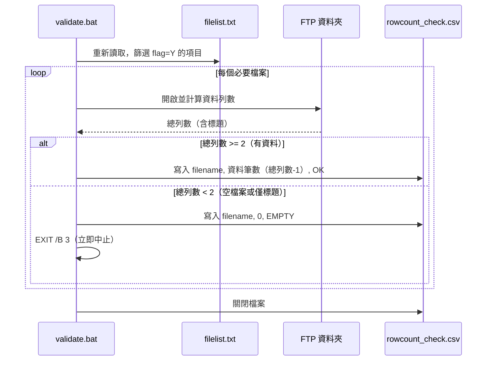

# windows_batch_audit_function

# Design Document: file-validation-check

## Overview

本功能透過 Windows Batch Script 實作兩階段資料檢核機制：第一階段驗證 FTP 資料夾中所有必要檔案是否存在，第二階段確認每個必要檔案內含有效資料（至少一筆非標題列記錄）。任一階段發現異常即立即中止程式，並將檢核結果輸出為 CSV 報表。

本設計採用「快速失敗（Fail-Fast）」原則，確保資料處理流程在不完整或空白資料的情況下不會繼續執行，降低後續處理產生錯誤結果的風險。

## Architecture



## Sequence Diagrams

### Phase 1：存在性檢查流程



### Phase 2：資料筆數檢查流程



## Components and Interfaces

### Component 1：filelist.txt（輸入規格）

**Purpose**：定義待檢核的檔案清單及其必要性旗標

**格式規格**：
```
filename,flag
orders_20240101.csv,Y
reference_data.csv,Y
optional_log.csv,N
```

**欄位定義**：

| 欄位 | 型別 | 說明 |
|------|------|------|
| filename | String | 檔案名稱（含副檔名，不含路徑） |
| flag | Char(Y/N) | Y = 必要存在；N = 非必要，僅記錄 |

**驗證規則**：
- 第一列為標題列（`filename,flag`），迴圈處理時需跳過
- `flag` 僅接受大寫 `Y` 或 `N`
- `filename` 不可為空白
- 每行以 CRLF（Windows 換行）結尾

---

### Component 2：validate.bat（主程式）

**Purpose**：執行兩階段檢核邏輯的主控 Batch Script

**介面（呼叫方式）**：
```bat
validate.bat [FTP_PATH] [FILELIST_PATH] [OUTPUT_DIR]
```

**參數**：

| 參數 | 說明 | 預設值 |
|------|------|--------|
| FTP_PATH | FTP 資料夾本地或 UNC 路徑 | `\\server\ftp\incoming` |
| FILELIST_PATH | filelist.txt 的完整路徑 | `.\filelist.txt` |
| OUTPUT_DIR | CSV 輸出目錄 | `.\output` |

**回傳碼（Exit Code）**：

| 代碼 | 意義 |
|------|------|
| 0 | 全部檢核通過 |
| 1 | filelist.txt 不存在 |
| 2 | Phase 1 失敗（必要檔案不存在） |
| 3 | Phase 2 失敗（必要檔案無資料） |

---

### Component 3：existence_check.csv（Phase 1 輸出）

**Purpose**：記錄每個檔案的存在性檢查結果

**欄位設計**：

| 欄位名稱 | 型別 | 說明 |
|----------|------|------|
| check_time | DateTime | 檢查執行時間（YYYY-MM-DD HH:MM:SS） |
| filename | String | 檔案名稱 |
| flag | Char | 原始旗標（Y/N） |
| status | String | OK / MISSING / SKIPPED |
| full_path | String | 完整檔案路徑 |

**範例輸出**：
```
check_time,filename,flag,status,full_path
2024-01-15 09:30:00,orders_20240101.csv,Y,OK,\\server\ftp\incoming\orders_20240101.csv
2024-01-15 09:30:01,reference_data.csv,Y,MISSING,\\server\ftp\incoming\reference_data.csv
```

---

### Component 4：rowcount_check.csv（Phase 2 輸出）

**Purpose**：記錄每個必要檔案的資料筆數檢查結果

**欄位設計**：

| 欄位名稱 | 型別 | 說明 |
|----------|------|------|
| check_time | DateTime | 檢查執行時間（YYYY-MM-DD HH:MM:SS） |
| filename | String | 檔案名稱 |
| total_lines | Integer | 檔案總列數（含標題） |
| data_rows | Integer | 資料筆數（total_lines - 1，最小為 0） |
| status | String | OK / EMPTY |

**範例輸出**：
```
check_time,filename,total_lines,data_rows,status
2024-01-15 09:30:05,orders_20240101.csv,1501,1500,OK
2024-01-15 09:30:06,reference_data.csv,1,0,EMPTY
```

## Data Models

### filelist.txt 資料模型

```
STRUCTURE FileEntry
  filename : String   -- 檔案名稱，不含路徑
  flag     : Char     -- 'Y' = 必要 | 'N' = 非必要
END STRUCTURE
```

**驗證規則**：
- `filename` 不可為空字串
- `flag` 必須為 `Y` 或 `N`（大寫）
- 第一列固定為標題列，不作為資料處理

### CheckResult 資料模型（Phase 1）

```
STRUCTURE ExistenceResult
  check_time : String   -- 格式 YYYY-MM-DD HH:MM:SS
  filename   : String
  flag       : Char
  status     : String   -- 'OK' | 'MISSING' | 'SKIPPED'
  full_path  : String
END STRUCTURE
```

### RowCountResult 資料模型（Phase 2）

```
STRUCTURE RowCountResult
  check_time   : String   -- 格式 YYYY-MM-DD HH:MM:SS
  filename     : String
  total_lines  : Integer  -- >= 0
  data_rows    : Integer  -- total_lines - 1，最小為 0
  status       : String   -- 'OK' | 'EMPTY'
END STRUCTURE
```

## Error Handling

### 錯誤場景 1：filelist.txt 不存在

**條件**：程式啟動時找不到 filelist.txt  
**回應**：輸出錯誤訊息至 STDERR，不產生任何 CSV  
**中止**：`EXIT /B 1`

```bat
IF NOT EXIST "%FILELIST_PATH%" (
    ECHO [ERROR] filelist.txt not found: %FILELIST_PATH% 1>&2
    EXIT /B 1
)
```

---

### 錯誤場景 2：必要檔案不存在（Phase 1 失敗）

**條件**：flag=Y 的檔案在 FTP 資料夾中找不到  
**回應**：將該筆記錄寫入 existence_check.csv（status=MISSING），輸出錯誤訊息  
**中止**：`EXIT /B 2`（寫完 CSV 後立即中止，不繼續檢查其他檔案）

---

### 錯誤場景 3：必要檔案無資料（Phase 2 失敗）

**條件**：flag=Y 的檔案存在，但總列數 < 2（空檔案或僅有標題列）  
**回應**：將該筆記錄寫入 rowcount_check.csv（status=EMPTY，data_rows=0），輸出錯誤訊息  
**中止**：`EXIT /B 3`（寫完 CSV 後立即中止）

---

### 錯誤場景 4：輸出目錄不存在

**條件**：指定的 OUTPUT_DIR 不存在  
**回應**：自動建立目錄（`MKDIR`），若建立失敗則中止  
**中止**：`EXIT /B 1`

## Testing Strategy

### Unit Testing Approach

由於 Batch Script 無原生單元測試框架，採用「測試情境腳本」方式驗證：

- 建立 `test_cases\` 目錄，放置各種測試用 filelist.txt 與假檔案
- 每個測試情境執行後檢查 `ERRORLEVEL` 與輸出 CSV 內容
- 以 `test_runner.bat` 自動執行所有情境並比對預期結果

**關鍵測試情境**：

| 情境 | filelist.txt 內容 | FTP 狀態 | 預期 Exit Code |
|------|-------------------|----------|----------------|
| TC-01 | filelist.txt 不存在 | - | 1 |
| TC-02 | 所有 Y 檔案存在且有資料 | 全部存在 | 0 |
| TC-03 | 一個 Y 檔案不存在 | 部分缺失 | 2 |
| TC-04 | 所有 Y 檔案存在但一個為空 | 全部存在 | 3 |
| TC-05 | 所有 Y 檔案存在但一個只有標題 | 全部存在 | 3 |
| TC-06 | 只有 N 旗標的檔案 | 無需存在 | 0 |
| TC-07 | filelist.txt 只有標題列 | - | 0（無需檢查） |

### Property-Based Testing Approach

以下屬性在任何輸入下必須成立：

1. **快速失敗屬性**：若任一 flag=Y 的檔案不存在，Exit Code 必為 2，且 existence_check.csv 中該筆 status=MISSING
2. **完整性屬性**：Phase 1 通過後，existence_check.csv 的記錄數必等於 filelist.txt 的資料列數
3. **資料筆數正確性**：rowcount_check.csv 中 `data_rows = total_lines - 1`（當 total_lines >= 1）
4. **冪等性**：相同輸入執行兩次，產出的 CSV 內容（除 check_time 外）必須相同

### Integration Testing Approach

- 建立模擬 FTP 資料夾（本地路徑），放置測試用 CSV 檔案
- 執行完整的 validate.bat 流程，驗證兩個輸出 CSV 的格式與內容
- 測試 UNC 路徑（`\\server\share\`）與本地路徑（`C:\ftp\`）兩種情境

## Performance Considerations

- filelist.txt 預期規模：數十至數百筆，Batch Script 逐行處理效能足夠
- 計算列數使用 `find /c /v ""` 命令，對大型 CSV（百萬列）仍可在數秒內完成
- 若 FTP 為遠端 UNC 路徑，網路延遲可能影響 `IF EXIST` 檢查速度，建議在網路穩定環境執行

## Security Considerations

- FTP 路徑若為 UNC 路徑，需確保執行帳號有讀取權限
- 輸出 CSV 不應包含敏感資料（僅記錄檔名與狀態）
- filelist.txt 中的 filename 不應包含路徑分隔符（`\` 或 `/`），防止路徑穿越

## Dependencies

| 依賴項目 | 說明 |
|----------|------|
| Windows CMD / Batch | 執行環境，Windows XP 以上皆支援 |
| `find` 命令 | 用於計算檔案列數（`find /c /v ""`） |
| `for /f` 迴圈 | 用於逐行讀取 filelist.txt |
| `IF EXIST` | 用於檔案存在性檢查 |
| `%DATE%` / `%TIME%` | 用於記錄檢查時間戳記 |
| FTP 資料夾存取權限 | 執行帳號需有讀取權限 |
